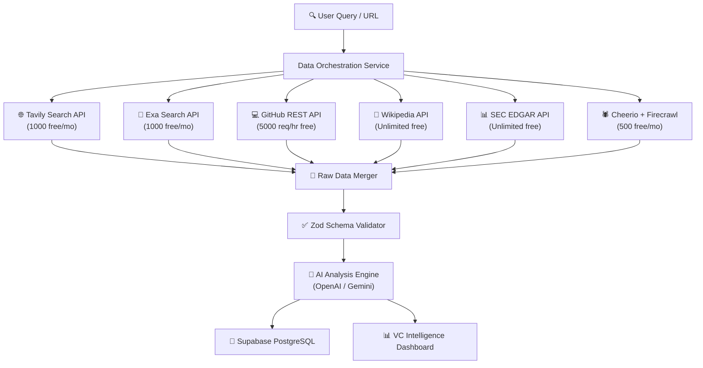

# VC Intelligence — Production Platform v2.0

<div align="center">
  <svg xmlns="http://www.w3.org/2000/svg" viewBox="0 0 800 320" width="100%">
    <defs>
      <!-- Gradients -->
      <linearGradient id="grad-primary" x1="0%" y1="0%" x2="100%" y2="100%">
        <stop offset="0%" stop-color="#8B5CF6" />
        <stop offset="50%" stop-color="#3B82F6" />
        <stop offset="100%" stop-color="#10B981" />
      </linearGradient>
      <linearGradient id="grad-glow" x1="0%" y1="0%" x2="100%" y2="0%">
        <stop offset="0%" stop-color="#7C3AED" stop-opacity="0.15" />
        <stop offset="100%" stop-color="#10B981" stop-opacity="0.05" />
      </linearGradient>
      <linearGradient id="bg-grad" x1="0%" y1="0%" x2="0%" y2="100%">
        <stop offset="0%" stop-color="#030712" />
        <stop offset="100%" stop-color="#0F172A" />
      </linearGradient>
    </defs>

    <!-- Background -->
    <rect width="800" height="320" rx="16" fill="url(#bg-grad)" stroke="#1E293B" stroke-width="1.5" />
    
    <!-- Decorative Grid Overlay -->
    <path d="M 0 40 L 800 40 M 0 80 L 800 80 M 0 120 L 800 120 M 0 160 L 800 160 M 0 200 L 800 200 M 0 240 L 800 240 M 0 280 L 800 280" stroke="#1E293B" stroke-width="0.5" stroke-dasharray="2, 4" />
    <path d="M 100 0 L 100 320 M 200 0 L 200 320 M 300 0 L 300 320 M 400 0 L 400 320 M 500 0 L 500 320 M 600 0 L 600 320 M 700 0 L 700 320" stroke="#1E293B" stroke-width="0.5" stroke-dasharray="2, 4" />

    <!-- Ambient Glow Paths -->
    <circle cx="400" cy="160" r="140" fill="url(#grad-glow)" filter="blur(20px)" />

    <!-- Node Network / Tech lines -->
    <path d="M 150 160 Q 250 100 400 160 T 650 160" fill="none" stroke="url(#grad-primary)" stroke-width="1.5" stroke-opacity="0.3" />
    <path d="M 150 200 Q 300 280 400 160 T 650 120" fill="none" stroke="url(#grad-primary)" stroke-width="1" stroke-opacity="0.2" />

    <!-- Dots representing data points -->
    <circle cx="150" cy="160" r="4" fill="#8B5CF6" />
    <circle cx="280" cy="120" r="3" fill="#3B82F6" />
    <circle cx="400" cy="160" r="6" fill="#10B981" />
    <circle cx="520" cy="200" r="3" fill="#3B82F6" />
    <circle cx="650" cy="160" r="4" fill="#8B5CF6" />

    <!-- Logo Icon -->
    <g transform="translate(376, 50)">
      <path d="M24 4L4 12v8c0 11 9 20 20 20s20-9 20-20v-8L24 4zm0 28a8 8 0 110-16 8 8 0 010 16z" fill="url(#grad-primary)" />
      <path d="M24 12a4 4 0 100 8 4 4 0 000-8z" fill="#030712" />
    </g>

    <!-- Logo Typography -->
    <text x="400" y="165" font-family="'Inter', -apple-system, sans-serif" font-size="34" font-weight="900" text-anchor="middle" fill="url(#grad-primary)" letter-spacing="4">VC INTELLIGENCE</text>
    
    <!-- Subtitle -->
    <text x="400" y="200" font-family="'Inter', -apple-system, sans-serif" font-size="13" font-weight="600" text-anchor="middle" fill="#94A3B8" letter-spacing="1.5">REAL-TIME MULTI-SOURCE STARTUP EVALUATION ENGINE</text>

    <!-- Version Badge inside SVG -->
    <rect x="365" y="225" width="70" height="20" rx="10" fill="#1E293B" stroke="#334155" stroke-width="1" />
    <text x="400" y="239" font-family="monospace" font-size="10" font-weight="bold" text-anchor="middle" fill="#10B981">v2.0-PRO</text>
  </svg>
</div>

<p align="center">
  
  
  
  
  
  
</p>

---

## ⚡ Core Concept & Architecture

Instead of relying on standard statically scraped profiles, **VC Intelligence v2.0** uses a **Parallel Ingestion Pipeline** to gather company indicators dynamically and runs them through an **8-Dimension Success Predictor** to check alignment with VC investment theses.

### Data Flow Pipeline


---

## 🎨 Key Features

### 1. Ingestion & Aggregation
* **Tavily AI & Exa AI:** Searches the web semantically for descriptions, news, and funding round outlines.
* **GitHub Repository Metrics:** Queries organization data (stars, forks, languages, commits, and contributors count) to calculate developer velocity and technology health.
* **Wikipedia REST Crawlers:** Extracts HQ location, founding year, and structural details.
* **Cheerio Scraper:** Parses company website page sources to identify pricing tiers, careers vacancies, and web technologies stack.

### 2. Predictive 8-Dimension Scoring
Calculates startup viability dynamically:
1. **Market (TAM/SAM):** Size of market target and customer density.
2. **Team Execution:** Development activity indicators.
3. **Product Depth:** Technical stack maturity and dependency safety.
4. **Traction Speed:** Web traffic trend, stars velocity, and growth signals.
5. **Financial Health:** Burn rate estimations and business pricing models.
6. **Competitive Edge:** Defensibility, unique moats, and competitors overlap.
7. **Timing:** Market maturity curves and regulatory changes.
8. **Momentum:** Time-series growth trends across all aggregated sources.

### 3. Deals Kanban Pipeline Board
* Move startups interactively between pipeline stages: `Discovered` ➔ `Researching` ➔ `Due Diligence` ➔ `Decision` ➔ `Invested` / `Passed`.
* Keep internal Due Diligence rich-text comments and notes synced locally.

### 4. High-End Glassmorphism Dark Theme
* Beautiful dark theme with translucent glass panels, glowing accent outlines, circular SVG gauges, progress bars, and tabbed workspaces.

---

## 🛠️ Tech Stack & Integrations

* **Framework:** Next.js 14 (App Router)
* **API Validation:** Zod Schema Validation
* **Rate Limiting:** Sliding window in-memory limiter with auto TTL cleanup
* **AI Engine:** Google Gemini (Primary compatibility API) & OpenAI GPT-4o-mini
* **Styling:** Tailwind CSS + Radix UI primitives
* **Visual Data:** Pure SVG dynamic gauges and charts

---

## 🚀 Getting Started

### 1. Clone & Install
```bash
git clone https://github.com/Shweta-Mishra-ai/vc-intelligence.git
cd vc-intelligence
npm install
```

### 2. Configure Environment Variables
Create a `.env.local` file at the root:
```env
# AI Model configuration (Fallback: Gemini -> OpenAI)
GEMINI_API_KEY=your_gemini_api_key_here
OPENAI_API_KEY=your_openai_api_key_here

# Search Credentials
TAVILY_API_KEY=your_tavily_key_here
EXA_API_KEY=your_exa_key_here
GITHUB_TOKEN=your_github_personal_access_token_here
```

### 3. Run Build & Dev
```bash
# Run Development server
npm run dev

# Run Production compile check
npm run build
```

---

## ⚠️ Important Vercel Configuration Notice

> [!IMPORTANT]
> If your project was originally configured to build a subdirectory in Vercel (e.g. `vc-intelligence-main`), please change the **Root Directory** setting to `/` (default root) in your **Vercel Dashboard** (under *Project Settings -> General -> Root Directory*) since all files are now located at the repository root level.
