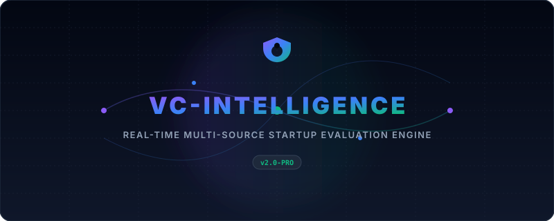
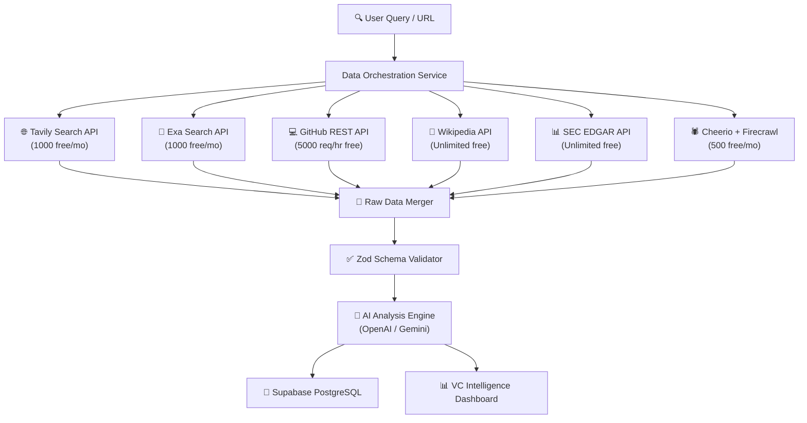

# VC Intelligence — Production Platform v2.0

<div align="center">
  
</div>


<p align="center">
  
  
  
  
  
  
</p>

---

## ⚡ Core Concept & Architecture

Instead of relying on standard statically scraped profiles, **VC Intelligence v2.0** uses a **Parallel Ingestion Pipeline** to gather company indicators dynamically and runs them through an **8-Dimension Success Predictor** to check alignment with VC investment theses.

### Data Flow Pipeline


---

## 🎨 Key Features

### 1. Ingestion & Aggregation
* **Tavily AI & Exa AI:** Searches the web semantically for descriptions, news, and funding round outlines.
* **GitHub Repository Metrics:** Queries organization data (stars, forks, languages, commits, and contributors count) to calculate developer velocity and technology health.
* **Wikipedia REST Crawlers:** Extracts HQ location, founding year, and structural details.
* **Cheerio Scraper:** Parses company website page sources to identify pricing tiers, careers vacancies, and web technologies stack.

### 2. Predictive 8-Dimension Scoring
Calculates startup viability dynamically:
1. **Market (TAM/SAM):** Size of market target and customer density.
2. **Team Execution:** Development activity indicators.
3. **Product Depth:** Technical stack maturity and dependency safety.
4. **Traction Speed:** Web traffic trend, stars velocity, and growth signals.
5. **Financial Health:** Burn rate estimations and business pricing models.
6. **Competitive Edge:** Defensibility, unique moats, and competitors overlap.
7. **Timing:** Market maturity curves and regulatory changes.
8. **Momentum:** Time-series growth trends across all aggregated sources.

### 3. Deals Kanban Pipeline Board
* Move startups interactively between pipeline stages: `Discovered` ➔ `Researching` ➔ `Due Diligence` ➔ `Decision` ➔ `Invested` / `Passed`.
* Keep internal Due Diligence rich-text comments and notes synced locally.

### 4. High-End Glassmorphism Dark Theme
* Beautiful dark theme with translucent glass panels, glowing accent outlines, circular SVG gauges, progress bars, and tabbed workspaces.

---

## 🛠️ Tech Stack & Integrations

* **Framework:** Next.js 14 (App Router)
* **API Validation:** Zod Schema Validation
* **Rate Limiting:** Sliding window in-memory limiter with auto TTL cleanup
* **AI Engine:** Google Gemini (Primary compatibility API) & OpenAI GPT-4o-mini
* **Styling:** Tailwind CSS + Radix UI primitives
* **Visual Data:** Pure SVG dynamic gauges and charts

---

## 🚀 Getting Started

### 1. Clone & Install
```bash
git clone https://github.com/Shweta-Mishra-ai/vc-intelligence.git
cd vc-intelligence
npm install
```

### 2. Configure Environment Variables
Create a `.env.local` file at the root:
```env
# AI Model configuration (Fallback: Gemini -> OpenAI)
GEMINI_API_KEY=your_gemini_api_key_here
OPENAI_API_KEY=your_openai_api_key_here

# Search Credentials
TAVILY_API_KEY=your_tavily_key_here
EXA_API_KEY=your_exa_key_here
GITHUB_TOKEN=your_github_personal_access_token_here
```

### 3. Run Build & Dev
```bash
# Run Development server
npm run dev

# Run Production compile check
npm run build
```

---

## ⚠️ Important Vercel Configuration Notice

> [!IMPORTANT]
> If your project was originally configured to build a subdirectory in Vercel (e.g. `vc-intelligence-main`), please change the **Root Directory** setting to `/` (default root) in your **Vercel Dashboard** (under *Project Settings -> General -> Root Directory*) since all files are now located at the repository root level.
